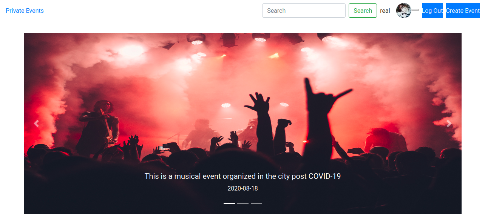
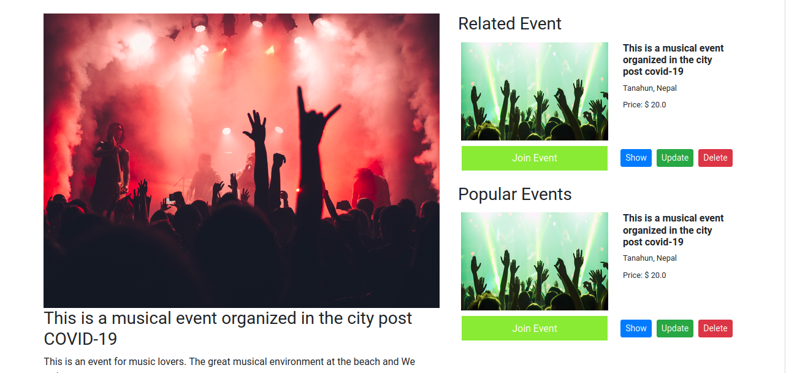

# Event manager

This is a platform for users to add upcoming event they are organizing and advertise the events with all the details. A user can join multiple events and create profile. The admin of an event get notification whenever another user join his events. This will be extremely useful to local event organizers to advertise their events.

## Language Used
- Ruby on Rails.
- SCSS
- javascript

## Screenshots

## [Live demo](https://github.com/sumancrest0001/manage-event/)

## Getting started
Run the following commands

- `git clone https://github.com/sumancrest0001/manage-event`
- `cd manage-event`
- `bundle install`
- `rails db:create`
- `rails db:migrate`
- `rails server`

## Future improvements
- [X] Add event authorization.
- [ ] Follower and followed for each user
- [ ] Add payment integration to join events.
- [ ] Add a group chat room for each event.

## Contributor

### sumancrest0001 
- [github](https://github.com/sumancrest0001)
- [linkedIn](https://www.linkedin.com/in/suman-shrestha0001/)

## 🤝 Contributing

Contributions, issues and feature requests are welcome!

Feel free to check the [issues page](https://github.com/sumancrest0001/manage-event/issues).

## Show your support

Give a ⭐️ if you like this project!

## Note
This is under progress. Some of the mentioned features in the description may not be added yet.

MIT Licensed

